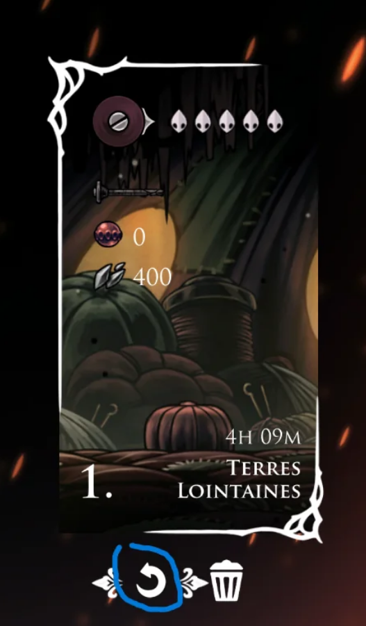

The names are translated from Chinese at the best of my knowledge, since some are nicknames presumably by Team Cherry themselves, i was not able to find a 1 to 1, but i'm pretty sure 95% of them are correct. Also the actual name you will find will be "GotSilkSpear" or "GotFaydownCloak" something like that. The name on the left is the nickname as reported in the dat files. Everytime you reach these "milestones" the game saves and stores them, up to, i believe 21. This is crucial for planning the speedrunning or steel soul achievments, because you can reset the time played (if you wasted 2 hours on high halls for example, restore the previous one without restarting the game).

Highlited the button to revert the chekpoing / auto save"

# == Act Start ==
* ACT_1 = "Act 1 Start"
* ACT_2 = "Act 2 Start"
* ACT_3 = "Act 3 Start"

# == Core/Movement Abilities ==
* GAINED_SILKSPEAR = "Learned Silk Spear"
* GAINED_SPRINT = "Learned Swift Step"
* GAINED_WALLJUMP = "Learned Spider Climb / Cling Grip"
* GAINED_HARPOON = "Learned Harpoon Dash" / Clawline(?)
* GAINED_BROLLY = "Gained Drifter"s Cloak"
* GAINED_NEEDOLIN = "Learned Weaver’s Needle / Needolin" (DEFEAT WIDOW)
* GAINED_DOUBLE_JUMP = "Gained Faydown Cloak"
* GAINED_SUPER_JUMP = "Learned Silk Soar"(?)
* GAINED_SLYTHSONG = "Learned Sylphsong" (From Eva / Weavnest Atla)

# == Combat Abilities ==
* GAINED_PARRY = "Learned Cross Stitch" (DEFEAT PHANTOM)
* GAINED_RUNE_BOMB = "Learned Rune Rage" (DEFEAT FIRST SINNER)
* GAINED_SILKCHARGE = "Learned Sharp Dart(?)" (West Wormways)
* GAINED_THREADSPHERE = "Learned Silk ThreadStorm"
* GAINED_SILKNEEDLE = "Learned Pale Nails" ("Silk Mother Arm")

# == Melodies ==
* GAINED_MELODY_ARCHITECT = "Learned Architect’s Melody"
* GAINED_MELODY_LIBRARIAN = "Learned Librarian’s Melody" (VAULTKEEPER?)
* GAINED_MELODY_CONDUCTOR = "Learned Conductor’s Melody"
* /
* GAINED_MELODY_BEAST = "Learned Beast Summon Melody" (Beast FAST TRAVEL?)
* GAINED_MELODY_DEEP = "Elegy of the Deep" (Act 3)

# == Crests ==
* GAINED_WANDERER = "Gained Wanderer Crest"
* GAINED_REAPER = "Gained Reaper Crest"
* GAINED_WITCH = "Gained Witch Crest"

* GAINED_TOOMASTER = "Gained Architect Crest"
* GAINED_SHAMAN = "Gained Shaman Crest"

# == True Ending ==
* GAINED_HEART_BLOOM = "Defeated Nyleth"
* GAINED_HEART_CLOVER = "Defeated Clover Dancer"
* GAINED_HEART_CORAL = "Defeated Shell King Kahan"
* GAINED_HEART_HUNTER = "Defeated Karmelita"

# == Others ==
* GAINED_CURSE = "Curse of the Twisted Bud"
* GAINED_WHITE_FLOWER = "Gained Eternal Bloom"
* SAVED_BELLHART = "Save Bellhart" (?)
* SLAB_CAPTURED = "Imprisoned in the Slab Jail / Caged"
* UNLOCKED_MELODY_LIFT = "Open Cradle Lift"
* GAINED_BEAST = (fast travel?)
